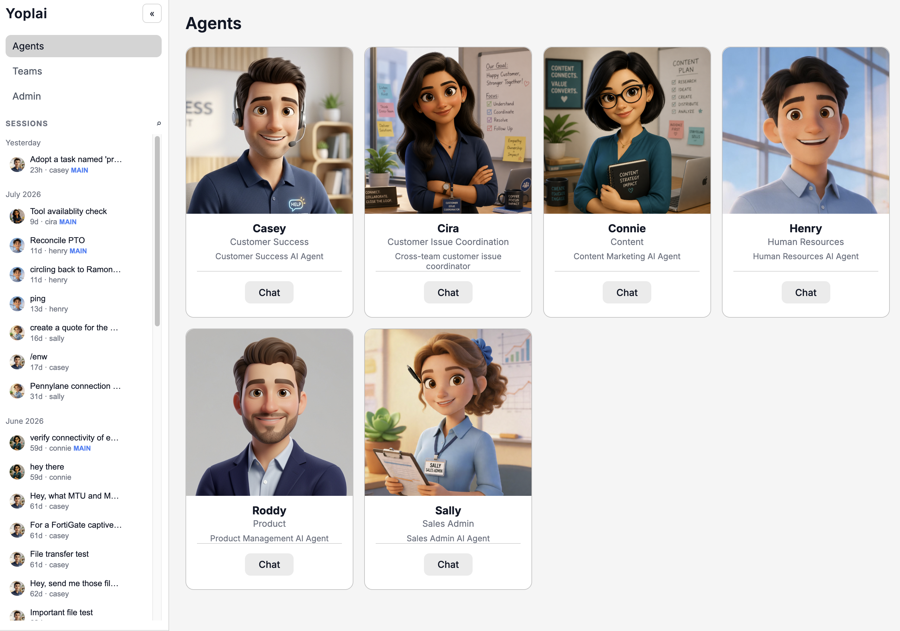

# Yoplai

Self-hosted gateway for running AI agents through a web UI, CLI, messaging channels, scheduled jobs, and project workflows.



Yoplai keeps configuration, conversations, and project data on your machine. Start with one agent locally, then add channels, automation, authentication, or container isolation as needed.

## What you get

- Web chat with streaming, tool calls, files, and session history
- Multiple configurable agents and external CLI subagents
- Optional Discord, Slack, Telegram, IRC, and webhook entry points
- Slack credential refusals offer [one personal connection link](docs/slack-credential-connect.md) for pairing plus Google OAuth, extension tokens, or extension-owned OAuth, with a confirmation in the original thread.
- Slack `!pair` links an existing web account for personal credentials; [setup and email requirements](packages/extensions/slack/README.md#account-pairing).
- Scheduled jobs, project boards, slices, and orchestration
- File-based runtime data by default; SQLite only for optional features such as multi-user auth

## Quick start

This guide creates one local Pi agent authenticated with Anthropic OAuth. No Docker, database, messaging app, or public server is required.

### 1. Prerequisites

Install:

- [Git](https://git-scm.com/)
- Node.js **22.19.0 or newer**
- pnpm **11** (`corepack enable` can install the repository-pinned version)
- An Anthropic account for OAuth login

Check versions:

```bash
node --version
pnpm --version
```

### 2. Clone and install

```bash
git clone https://github.com/tobalsan/yoplai.git
cd yoplai
pnpm install
```

### 3. Create the local configuration

Yoplai reads `$YOPLAI_HOME/yoplai.json`. The default home is `~/.yoplai`; setting it explicitly makes later commands predictable.

```bash
export YOPLAI_HOME="$HOME/.yoplai"
mkdir -p "$YOPLAI_HOME/agents/my-agent"

cat > "$YOPLAI_HOME/yoplai.json" <<'JSON'
{
  "version": 3,
  "agents": ["agents/*"],
  "extensions": {},
  "gateway": { "bind": "loopback", "port": 4000 },
  "ui": { "bind": "loopback", "port": 3000 }
}
JSON
```

`agents` paths are relative to `yoplai.json`. Yoplai does not create this file automatically.

### 4. Configure one agent

Agent folder name and `id` must match:

```bash
cat > "$YOPLAI_HOME/agents/my-agent/agent.yaml" <<'YAML'
id: my-agent
name: My Agent
auth:
  mode: oauth
model:
  provider: anthropic
  model: claude-sonnet-4-5
YAML
```

Yoplai creates missing workspace prompt files (`AGENTS.md`, `SOUL.md`, and `USER.md`) on first run. You can edit them later to customize agent behavior.

### 5. Build and authenticate

Build before running any `pnpm yoplai` command from a fresh clone:

```bash
pnpm build
pnpm build:web
pnpm yoplai auth login anthropic
pnpm yoplai auth status
```

Follow OAuth instructions printed in terminal. Credentials are stored under `$YOPLAI_HOME`; do not commit that directory. `auth login` only lists OAuth providers (e.g. `anthropic`, `openai-codex`). Every other Pi provider is API-key based and needs no login: set the provider's env var (`<PROVIDER>_API_KEY`, e.g. `OPENCODE_API_KEY` for `opencode-go`, `OPENROUTER_API_KEY` for `openrouter`; see the [Pi provider table](https://pi.dev/docs/latest/providers#api-keys)) in your shell or `$YOPLAI_HOME/.env`, and reference it with `$env:NAME`—never put plaintext secrets in tracked configuration.

If a newly released Pi model is missing from Yoplai's bundled catalog, run `pnpm yoplai models refresh` to update `$YOPLAI_HOME/models-store.json`, then restart the gateway.

### 6. Start Yoplai

```bash
pnpm yoplai gateway
```

Keep terminal open. Then visit:

- Web UI: <http://127.0.0.1:3000>
- Gateway health: <http://127.0.0.1:4000/health>

### 7. Verify installation

In another terminal:

```bash
export YOPLAI_HOME="$HOME/.yoplai"
curl -fsS http://127.0.0.1:4000/health
curl -fsS http://127.0.0.1:4000/api/agents
```

Expected results:

1. Health returns `{"ok":true}`.
2. Agent list contains `my-agent`.
3. Web UI opens and shows **My Agent**.
4. Sending a message produces a model response.

Once foreground startup works, see [Self-hosting](docs/self-hosting.md) for background service and server deployment options.

## Basic customization

Edit `$YOPLAI_HOME/agents/my-agent/agent.yaml` to change model or agent settings. Edit prompt files in the same folder to define identity and instructions.

Enable optional features in root `extensions`:

```json
{
  "version": 3,
  "agents": ["agents/*"],
  "extensions": {
    "scheduler": { "enabled": true },
    "projects": { "enabled": true, "root": "~/projects" }
  },
  "gateway": { "bind": "loopback", "port": 4000 },
  "ui": { "bind": "loopback", "port": 3000 }
}
```

Agent-specific tool extensions also require an entry in `agent.yaml`. See [Configuration](docs/configuration.md) and [Extensions](docs/extensions.md).

In multi-user mode, add your own extension API token (and, if needed, your own email/subdomain or other settings) on the **Just me** tab of the extension configuration form. Members of the agent's team (and admins) can choose **Whole team** and edit shared settings; existing team tokens remain the fallback. Personal tokens require `oauth.encryptionKey` and stay encrypted on the gateway. See [personal extension tokens](docs/extensions.md#personal-extension-api-tokens).

Use an agent's **My connections** tab to inspect and disconnect your personal connections and see team availability. **Account settings** lets you remove Slack pairings; the next Slack request uses the unpaired flow. Disconnecting affects only your credentials and the next request uses team credentials when available.

## Troubleshooting

### `yoplai.json` not found

Confirm `YOPLAI_HOME` is exported in the terminal running gateway and that `$YOPLAI_HOME/yoplai.json` exists.

### Agent missing or invalid

Confirm `$YOPLAI_HOME/agents/my-agent/agent.yaml` exists and its `id` matches folder name. Check gateway terminal for validation errors.

### Authentication or provider error

Run `pnpm yoplai auth status`. Re-run `pnpm yoplai auth login anthropic` if needed, then restart gateway.

### `dist` or CLI module not found

Run `pnpm build && pnpm build:web` before `pnpm yoplai ...`.

### Port already in use

Change `gateway.port` and `ui.port` in `yoplai.json`, then use those ports for health and browser checks.

### Docker error

Docker is needed only for agents with `sandbox.enabled: true`. Remove that setting for basic setup or follow [Container isolation](docs/container-isolation.md).

## Documentation

Start with the [documentation index](docs/README.md).

- [Configuration](docs/configuration.md) — root config, agents, environment, network, UI
- [Self-hosting](docs/self-hosting.md) — services, remote access, upgrades, backups
- [Extensions](docs/extensions.md) — optional feature catalog and enablement
- [Webhooks](docs/webhooks.md) — HTTP-triggered agent runs
- [Container isolation](docs/container-isolation.md) — Docker sandboxing and OneCLI
- [Web UI](docs/web-ui.md) — routes and product workflows
- [CLI](docs/cli.md) and [API](docs/api.md)
- [Projects](docs/projects.md), [Scheduling](docs/scheduling.md), and [Channels](docs/channels.md)
- [OAuth](docs/oauth.md) and [OpenClaw](docs/openclaw.md)
- Google tool connections support **Just me** (your signed-in web requests) or **Whole team** (shared fallback); existing connections remain shared. See [connection scopes](docs/oauth.md#extension-oauth-connections).
- [Models and skills](docs/models-and-skills.md)
- [Development](docs/development.md) and [data layout](docs/data-layout.md)

For coding-agent architecture and ownership, see [`docs/llms.md`](docs/llms.md).
